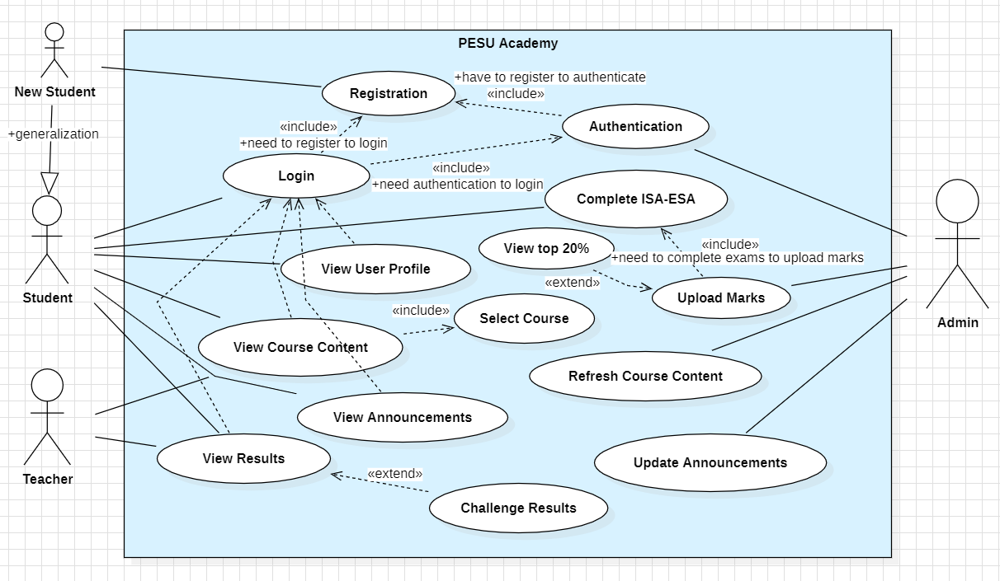
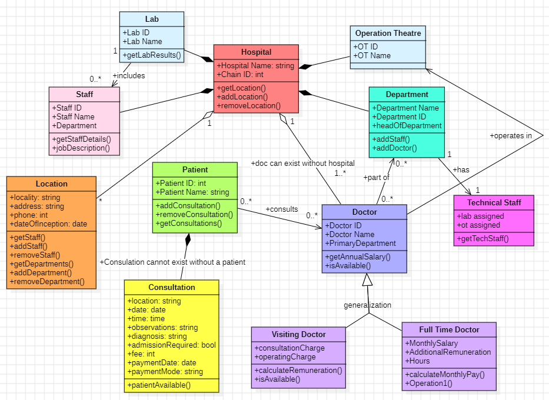

# PES University App - Use Case Diagram, Hospital Management System - Class Diagram

This repository contains:
   1) The Use Case Diagram for the PES University App,
      


   2) The Class Diagram for Hospital Management System
developed using object-oriented analysis and design principles with Java.



## Overview

The Use Case Diagram provides a high-level view of the functionalities and interactions of the PES University App. This visual representation is a key component of the object-oriented analysis and design process.

## Features

- **Use Case Modeling**: Describes the interactions between actors (users) and the system, showcasing various use cases and their relationships.

## Getting Started

1. Clone the repository:

   ```bash
   git clone https://github.com/urvashii-b/PESU-UseCaseDiagram.git

2. Open StarUML and use the code

## Explore the Diagram:

Analyze the Use Case Diagram to understand the functionality and interactions of the PES University App.

## Feedback

Feel free to provide feedback, report issues, or contribute to the development of the PES University App. We welcome your collaboration and input!

